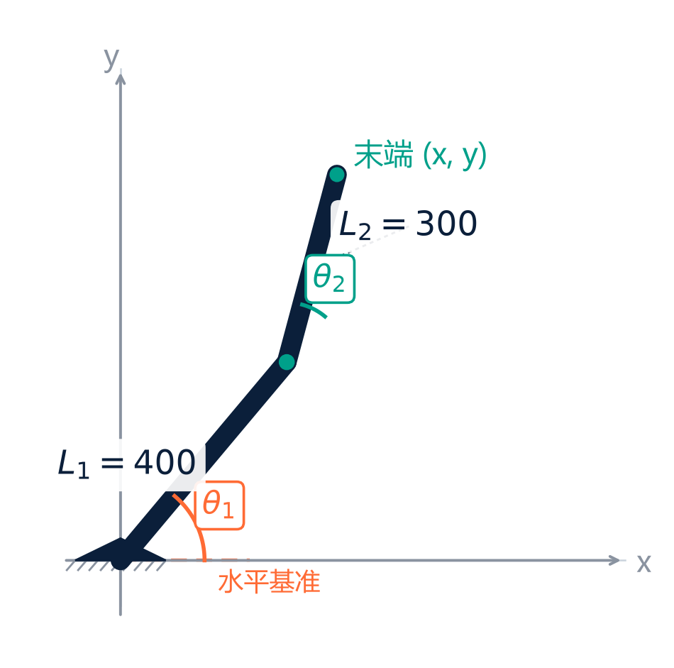

# linmumu-course-prep —— 大学老师备课流水线

*产出课件配图示例：《工业机器人技术基础》第 6 节 —— 每个知识点必配可视化，配色随学科族自动对齐。*

老师给一句话，还他一节课：设计 → 课件 → 讲稿 → 测验 → 交互演示 → 挑刺报告，六个文件自动落盘，最后在对话框里拍板确认。

## 这是什么

- `SKILL.md` —— 流程指令（铁律 10 条 + 默认流程 + 配色 + 降级阶梯）
- `references/exemplar.md` —— 内容质量金样（01/03/04/05/06 各有合格与不合格对照）
- `scripts/` —— 固化的排版手艺（deck_lib 设计系统 + 课件/配图模板 + 交互演示骨架 + 排版自查 + 交付前三查）

## 给老师的三种用法

### 场景 A：工作坊现场（讲师的机器）

什么都不用装。讲师当场跑，老师看效果、带走产出文件夹和本 skill 包。

### 场景 B：老师本机使用（推荐配置）

需要三件东西，一次性装好，约 10 分钟：

1. **装一个带 skill 的 AI 助手**（WorkBuddy / Claude Code 等任一）——这是唯一的"软件安装"
2. **装 Python**：python.org 下载，安装时勾选 "Add to PATH"
3. **有桌面 PowerPoint 或 WPS**（多数老师已有）——生成后自动逐页截图自查排版用

然后把整个 `linmumu-course-prep` 文件夹放进助手的知识/skill 目录（WorkBuddy：设置 → 技能 → 导入文件夹；Claude Code：复制到 `~/.claude/skills/`）。之后在对话框说「备一节 XX课 第X节 XX」即可。首次运行时助手会自动装齐排版组件（python-pptx、matplotlib 等）；装不上的环境会自动走降级路线，并在确认单里注明——不影响使用。

### 场景 C：什么都不装

也能用，但产出降级：助手用自带排版能力生成课件（版式按 deck_lib 规格近似）、逐页截图自查跳过。会在确认单里标一句"未用标准排版引擎"。六个文件照常出，课堂可用。

## 老师需要会什么

**只会打字。** 全程对话，没有命令行、没有终端、没有 API key。技术环节（脚本、依赖、排版自查）全部由 agent 在后台处理，按铁律 6 对老师零提及。

## 质量承诺与边界

- 版式、配色、文件结构、自查流程：已锁死（脚本固化），任何 agent 跑出来一致
- 内容标准：有金样对照（exemplar.md），低于金样即返工
- 内容表达力：取决于所用模型——同一 skill 在弱模型上内容会糙，这是唯一不受控项
- 交付前三查（数字复算 / 配色 diff / 引用存在性）每节固定跑，结果写进 00 附注区；数字台账 `_recalc.py` 随讲稿一起产出

## 已知边界（诚实声明）

- 课件里的「▶ 看演示」是视觉提示不是超链接——本地文件超链接在网页预览器里必报错，老师按文件名去同文件夹双击 HTML 即可
- 批量模式整门课跑完后，先看每节文件夹里的 00_待你确认.md，从待确认条数最多的节开始审
- 改动 skill 后必须跑标准自测课（《自动控制原理·根轨迹》），过关线见 SKILL.md「自测约定」
- 挑刺环节（06）的可靠性是**观察项**：实测两轮 18 条意见 17 条成立，暂未失效；但同一会话高度迭代时自我批改有宽容偏差风险——重要课程建议换个新会话重跑一次 06 交叉验证
